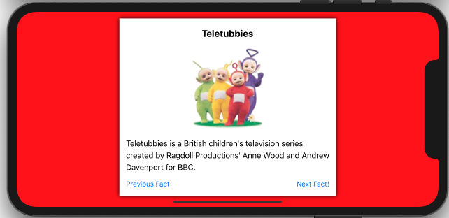

# UIDynamicView

[](https://travis-ci.org/osfunapps/UIDynamicView)
[](https://cocoapods.org/pods/UIDynamicView)
[](https://cocoapods.org/pods/UIDynamicView)
[](https://cocoapods.org/pods/UIDynamicView)


 



## Introduction
Use this library if you want to create views FAST without creating a pesky .xib file for every single view.

## Usage

Just create the dynamic view and add the subviews you would like to use.

 ```
private func popFactsDialog() {
      
    // build the dynamic view with all of the props
    let dv = UIDynamicView()
    dv.prepareView(parentView: view,
                   padding: 14,
                   margin: 14,
                   maxWidthPercentFromParent: 0.65)
    dv.dropShadow(shadowRadius: 5.0)
    
    // add the title
    let topTitleProps = InitialLabelProps(text: "Teletubbies",
                                          textAlignment: .center,
                                          font: UIFont.systemFont(ofSize: 20, weight: .bold))
    dv.addView(initialProps: topTitleProps)
    
    // add the image
    let imgProps = InitialUIImageViewProps(imageName: "tt",
                                           widthPercentFromParent: 0.3,
                                           tag: 99,
                                           alignment: .center)
    dv.addView(initialProps: imgProps)
    
    // add the description
    let descriptionProps =  InitialLabelProps(text:
        """
        Teletubbies is a British children's television series
        created by Ragdoll Productions' Anne Wood and Andrew
        Davenport for BBC.
        """,
        textAlignment: .left,
        font: UIFont.systemFont(ofSize: 17)
    )
    dv.addView(initialProps: descriptionProps)
    
    // add the footer buttons
    let nextFactButton = InitialButtonProps(labelText: "Previous Fact",
    alignment: .left,
    tapSelector: #selector(onPreviousFactTap))
    
    let nextBtn = InitialButtonProps(labelText: "Next Fact!",
                                         alignment: .right,
                                         tapSelector: #selector(onNextFactTap))
    let footerStackViewProps = InitialStackViewProps(subviewsInitialPropsList: [nextFactButton, nextBtn])
    
    dv.addView(initialProps: footerStackViewProps)
    dv.attachView(parentView: view)
}
  
@objc func onPreviousFactTap() {
}
  
@objc func onNextFactTap() {
}
 ```

OR another example:

 ```
private func popHelpDialog() {
        
    // build the dynamic view with all of the props
    dv = UIDynamicView()
    dv.prepareView(parentView: view,
                   padding: 14,
                   margin: 14,
                   maxWidthPercentFromParent: 0.65)
    dv.dropShadow(shadowRadius: 5.0)
    
    // add the title
    let topTitleProps = InitialLabelProps(text: "Help",
                                          textAlignment: .center,
                                          font: UIFont.systemFont(ofSize: 20, weight: .bold))
    dv.addView(initialProps: topTitleProps)
    
    // add the description
    let descriptionProps =  InitialLabelProps(text:
        """
        Please watch the below video to understand how to use the app
        """,
        textAlignment: .left,
        font: UIFont.systemFont(ofSize: 19)
    )
    dv.addView(initialProps: descriptionProps)
    
    // add the youtube video
    let videoProps = InitialYoutubeVideoProps(videoId: "BywDOO99Ia0",
                                              widthPercentFromParent: 0.75,
                                              alignment: .center)
    dv.addView(initialProps: videoProps)
    
    // add the footer button
    let okBtnProps = InitialButtonProps(labelText: "OK",
    alignment: .right,
    tapSelector: #selector(onOkBtnTap))
    
    dv.addView(initialProps: okBtnProps)
    dv.attachView(parentView: view)
}
 ```

## Dialog Wrapper

You can also use the dialog wrapper for a faster dialog buildup (the Controller Connection example)
 ```
private var dialogWrapper: UIDialogWrapper!
    
    private func popDialog() {
        
        // prepare the dialog
        dialogWrapper = UIDialogWrapper(parentView: view, margin: 20, maxWidthPercentFromParent: 0.6)
                                        
        // set title and description                                
        dialogWrapper.setTitle(text: "Controller Connection")
        dialogWrapper.setTopDesription(text: """
                NOTICE: iOS 13.0 is required to connect your controller via Bluetooth

                - With your Xbox controller, long click on the Xbox and pairing buttons together, until the Xbox button will start flashing
                - In your iPhone/iPad, go to Settings app -> tap on Bluetooth -> activate it
                - Look for the Xbox Controller in the list of devices, click on it and approve the connection
                — You're all set!
                """, size: 16)
                
        // add bottom description, youtube video and footer        
        dialogWrapper.setBottomDesription(text: "** UPDATED: 10.4.2020")
        dialogWrapper.setYoutubeVideo(videoId: "wPV0QtYm-4o", widthPercentFromParent: 0.75)
        dialogWrapper.setFooter(leftBtnText: "Cancel", rightBtnText: "Ok", leftBtnTapSelector: #selector(onLeftTap), rightBtnTapSelector: #selector(onRightTap))
        
        // attach the view to it's parent
        dialogWrapper.attachView(parentView: view)
    }
    
    @objc func onLeftTap() {
        dialogWrapper.dismiss()
        print("on left tap")
    }
    
    @objc func onRightTap() {
        print("on right tap")
    }
```


## Installation

UIDynamicView is available through [CocoaPods](https://cocoapods.org). To install
it, simply add the following line to your Podfile:

```ruby
pod 'UIDynamicView'
```

## Author

osApss, support@os-apps.com

## License

UIDynamicView is available under the MIT license. See the LICENSE file for more info.
